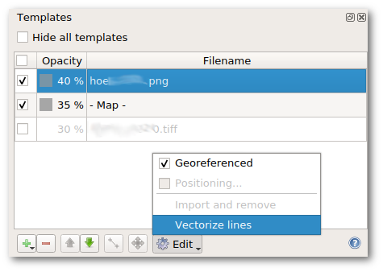
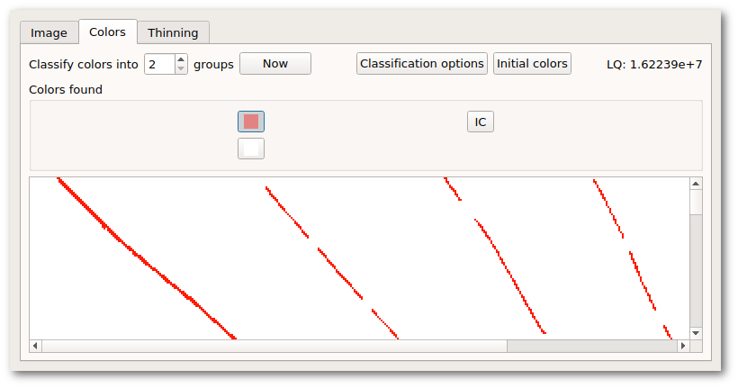
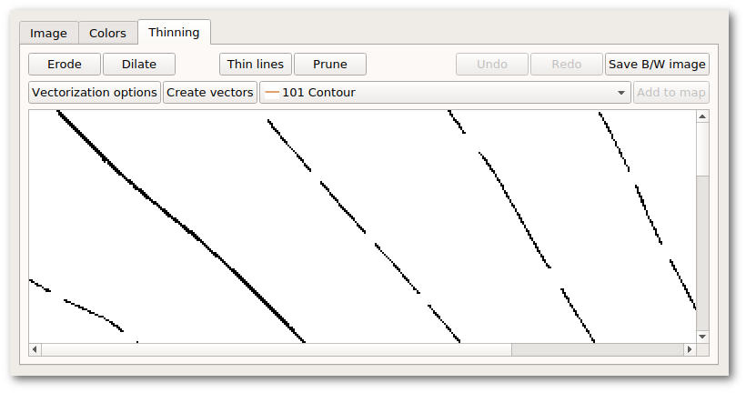
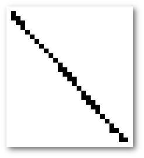

CoVe (for Contour Vectorizer) is the name of a tool which lets users generate
vector line objects from visual lines in raster graphics templates. Despite of
its original name, it is not limited to contour lines.

## Starting CoVe

The vectorizer tool is started from the actions offered by the "Edit" button in
the template list widget. Note that this tool is available only for raster
graphics templates (e.g. JPG, PNG, TIFF), not for vector graphics (e.g. DXF,
OSM, SHP).

## The "Image" tab

The "Image" tab is the first one displayed after starting the vectorizer tool.
It shows the original image and offers tools which allow to reduce certain types
of noise, e.g. from scanning of old maps. These tools operate only in memory,
i.e. they do not alter the original template image.

## The "Colors" tab

This tab offers color classification and selection. Color classification
analyzes the image for a small set of key colors. After classification, the
user must select the color (or maybe multiple colors) which shall be subject
to vectorization.

## The "Thinning" tab

This tab provides the final steps of vectorization. It shows a black/white image
based on the color(s) selected by the user on the previous tab. Apart from the
actual vectorization steps, it offers morphological manipulation steps which are
essential for a successful vectorization of the image. For these morphological
operations, there are also undo and redo actions.

#### Erode

This tool remove a small margin from every shape in the image.

#### Dilate

This tool adds a small margin to every shape in the image. In particular, this
tool is useful when the pixels of an expected vector line are direct neighbors
diagonally but not horizontally or vertically.

#### Thin lines

This tool is used to reduce thick shapes to mimimal lines. It may take some time
to complete its task, and it is not possible to report progress accurately.

Note that this tool doesn't work perfectly: it may create small artifacts e.g.
at line ends.

#### Prune

This tool removes pixels from line ends. In that way, it is possible to mitigate
the artifacts created by the previous step.

#### Example

Original black/white image. Note that some pixels are neighboring only
diagonally: 

Image after "Dilate" step: 

Image after "Thin lines" step. Note the small fork at the top-left end: 

Image after "Prune" step:

#### Vectorization and adding to the map

The "Create vectors" button starts the actual vectorization process, creating a
temporary preview. The user may adjust vectorization options. For example, it is
possible to automatically close small gaps, e.g. from dashed lines in the image.

"Add to map" finally adds the preview objects to the map, with the symbol
selected in front of this button. Note that this button does not close the
window. You may continue with another color, by selecting the "Color" tab again.

All objects added by this tool carry a tag "generator" with value "cove".

