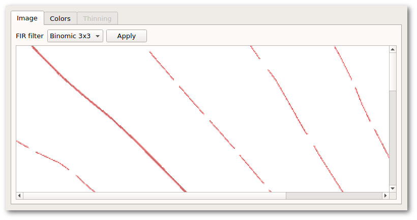
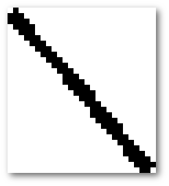
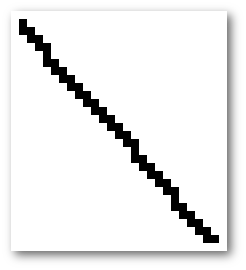

CoVe (for Contour Vectorizer) is the name of a tool which lets users generate
vector line objects from visual lines in raster graphics templates. Despite of
its original name, it is not limited to contour lines.

The basic line vectorization in a bitmap image always follows the below steps:
1) Choose bitmap image to work on.
2) Classify colors in the image into groups and produce color-reduced image.
   Choose which colors correspond to the lines of interest.
3) Perform **line thinning** and run vectorization. Store the resulting lines into the map.

The tool offers a number of tuning options. They are, however, not required on good quality images.

## Starting CoVe

The vectorizer tool is started from the actions offered by the "Edit" button in
the template list widget. Note that this tool is available only for raster
graphics templates (e.g. JPG, PNG, TIFF), not for vector graphics (e.g. DXF,
OSM, SHP).

## The "Image" tab

The "Image" tab is the first one displayed after starting the vectorizer tool.
It shows the original image and offers tools which allow to reduce certain types
of noise, e.g. from scanning of old maps. These tools operate only in memory,
i.e. they do not alter the original template image.

## The "Colors" tab

This tab offers color classification and selection. Color classification
analyzes the image for a small set of key colors. After classification, the
user must select the color (or maybe multiple colors) which shall be subject
to vectorization.

The most important control on this tab is the number of colors to be identified
in the image. For simple two-color images where there only the objects of
interest, the default setting of "2" is sufficient. However, for real scanned
maps the number will typically be in the range of 15-20. The reason is that
overprinting and color bleeding will create new color combinations which
must be identified by the tool.

## The "Thinning" tab

This tab provides the final steps of vectorization. It shows a black/white image
based on the color(s) selected by the user on the previous tab. Apart from the
actual vectorization steps, it offers morphological manipulation steps which are
essential for a successful vectorization of the image. For these morphological
operations, there are also undo and redo actions.

#### Erode

This tool removes a small margin from every shape in the image. Individual pixels
and thin lines will disappear after this operation.

#### Dilate

This tool adds a small margin to every shape in the image. In particular, this
tool is useful when the pixels of an expected vector line are direct neighbors
diagonally but not horizontally or vertically.

#### Thin lines

This tool is used to reduce thick shapes to minimal skeletons suitable for the
vectorizer. You will always use this tool just before creating the vectors. 

Note that this tool may take some time to complete its task, and it is not
possible to report progress accurately.

The algorithm may create line endings which do not accurately match what a human
would expect, e.g. small forks or arcs. This is normal, but in some cases it may
negatively affect the result of the "Create vectors" step.

#### Prune

This tool removes pixels from line ends. In that way, it is possible to mitigate
the artifacts created by the previous step if needed.

#### Example

Original black/white image. Note that some pixels are neighboring only
diagonally: 

Image after "Dilate" step: 

Image after "Thin lines" step. Note the small fork at the top-left end: 

Image after "Prune" step:

#### Combinations of tools
##### Dilate-erode

This combination fills small gaps and missing pixels in lines and smooths
the lines by removing small turns. However, it will also meld closely
spaced lines.

##### Erode-dilate

This combination makes all single-pixel objects disappear. This
is useful for removing noise from the picture when the main objects
in the are thick enough to survive the erosion.

#### Vectorization and adding to the map

The "Create vectors" button starts the actual vectorization process, creating a
temporary preview. The user may adjust vectorization options. For example, it is
possible to automatically close small gaps, e.g. from dashed lines in the image.

"Add to map" finally adds the preview objects to the map, with the symbol
selected in front of this button. Note that this button does not close the
window. You may continue with another color, by selecting the "Color" tab again.

All objects added by this tool carry a tag "generator" with value "cove".

