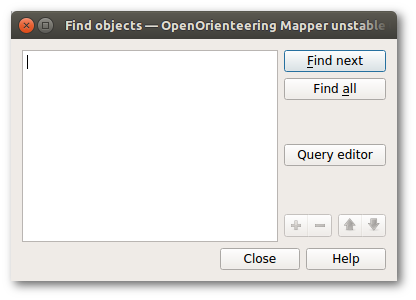
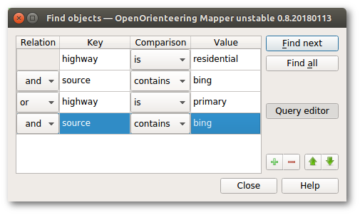

The "Find objects" dialog allows to find and select objects in the current map part based on their tags, text, or symbol name.
It is opened from the View menu.

## Querying objects

The main element of the "Find objects" dialog is an input field for the text you want to find.
The text is looked for in the following *textual properties*:

 - in the displayed text of text objects,
 - in the name of symbols assigned to objects,
 - in the values and keys of object tags.

## Advanced query language

With just a few keywords, you may enter complex queries which connect subqueries
for general textual properties and for particular key-value combinations.
The following expressions are supported:

| Expression | Matching objects |
| ---------- | ---------------- |
| word       | having "word" in any textual property |
| "some words" | having the phrase "some words" in any textual property |
| expr1 AND expr2 | matching both expression expr1 and expr2 |
| expr1 OR expr2  | matching expression expr1 or expr2 (or both) |
| key = value | having a tag with the given key and value |
| key ~= word | having a tag with the given key and a value containing "word" |
| key != word | having a tag with the given key and a value different from "word", or not having a tag with this key |

AND has precedence over OR. You may use parentheses to nest operators in another way.

You may use double quotes to deal with keys and values containing white space or the special words and signs.
Inside double quotes, the backslash character is used to escape the special meaning of double quotes and backslash.

**This query language may be used in the second column of [CRT files](crt_files.md).**

## Buttons

The button "Find next" will select the next object matching the query.
The button "Find all will select all matching objects.
The main window's status line will temporarily display the number of selected objects.
(It may also indicate that the query is invalid.)

The "Query editor" button will replace the input field with a table for entering object tag queries.
Pressing the button again will restore the input field and make it show the query from editor view.

## Query editor  {#query-editor}

### Editor Layout

Each row in the editor represents a single condition in the query and its relation to the other conditions.

### Relation

The relation column specifies a logical operator describing how this row is related to the row above. Therefore the first row has no relation.

There are two possible relations: **and** or **or**. **and** relations take precedence over **or** relations. Within the editor the **and** relation is indented slightly to show this precedence.

Taking the precedence into account, the query in the screenshot above would map to the following textual query:

**(highway = "residential" AND source ~= "bing") OR ("highway" = "primary" AND "source" ~= "bing")**

### Key

The key is the name of the tag which this condition applies to. This field cannot be left empty.
(Otherwise the query is invalid.)

### Value

This field specifies a value that the actual tag's value is compared to.
It can be left empty.

### Comparison

The comparison defines how the actual value of the tag is compared to the value that was specified in the editor.

| Comparison | Description |
| ---------- | ----------- |
| is         | The tag specified must exist for the object, and that tag's value must exactly match the specified value. |
| is not     | If the tag specified exists for the object, then its value must not much the specified value. If the tag doesn't exist, the condition is true. |
| contains   | The tag specified must exist for the object, and its value must contain the specified value. If an empty value is specified, any value of the tag will match. This can be used to test for the existence of a particular tag. |

### Extra buttons for the query editor

The  and  buttons are used to add or delete a row.
Added rows appear below the currently selected row.

The  and  buttons move the selected row up or down.

